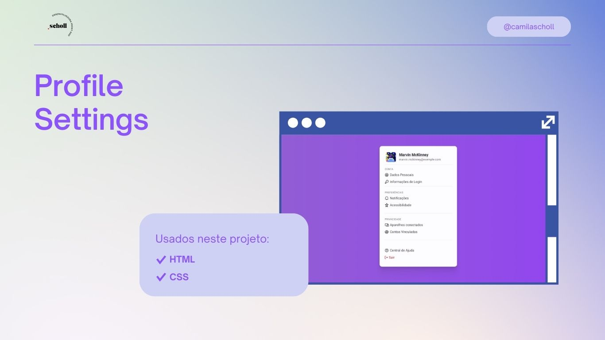

<h1 align="center"> Projeto Rocketseat </h1>

 

  

## 🚀 Tecnologias

Esse projeto foi desenvolvido com as seguintes tecnologias:

- HTML e CSS
- Git e Github
- Figma

## 💻 Projeto

O Profile Settings é um menu.

- [Acesse o projeto finalizado, online](https://camilascholl.github.io/profile-settings/)

## :memo: Licença

Esse projeto está sob a licença MIT.

---

Feito com ♥ by Scholl :wave: 